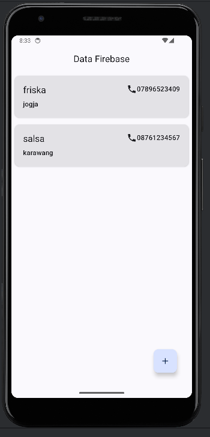
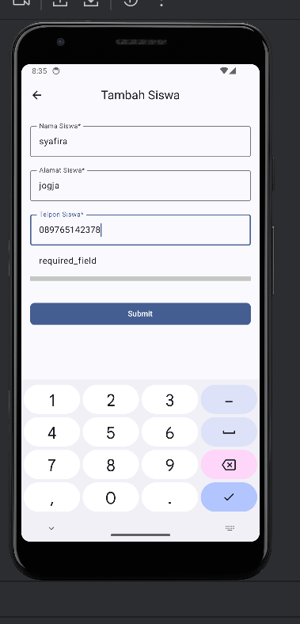
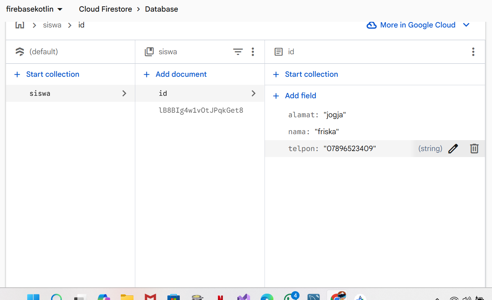
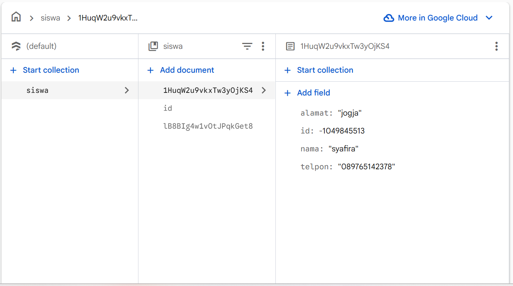
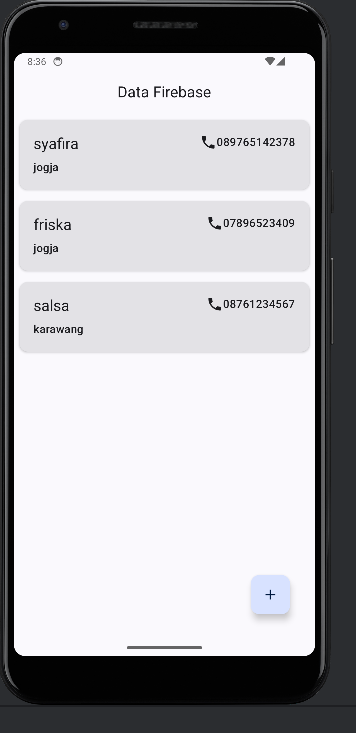

### 🔹 Tampilan Awal Aplikasi
  
*Gambar 1: Tampilan awal aplikasi sebelum dilakukan input data.*

### 🔹 Halaman Tambah Data Siswa
  
*Gambar 2: Halaman form untuk menambahkan data siswa.*

### 🔹 Kondisi Database Awal
  
*Gambar 3: Kondisi awal database Firebase sebelum data ditambahkan.*

### 🔹 Proses Penambahan Data ke Firebase
  
*Gambar 4: Proses penambahan data siswa ke Firebase Cloud Firestore.*

### 🔹 Hasil Setelah Data Ditambahkan
  
*Gambar 5: Tampilan aplikasi setelah data siswa berhasil disimpan.
