## 📌 Pertemuan 14 – Tambah Data Siswa (Firebase)

### 🔹 Tampilan Awal Aplikasi
  
*Gambar 1: Tampilan awal aplikasi sebelum dilakukan input data siswa.*

### 🔹 Halaman Tambah Data Siswa
  
*Gambar 2: Halaman form untuk menambahkan data siswa.*

### 🔹 Kondisi Database Awal
  
*Gambar 3: Kondisi awal database Firebase sebelum data ditambahkan.*

### 🔹 Hasil di Database Setelah Submit
  
*Gambar 4: Proses penambahan data siswa ke Firebase Cloud Firestore.*

### 🔹 Hasil Setelah Data Ditambahkan
  
*Gambar 5: Tampilan aplikasi setelah data siswa berhasil disimpan.*

---

## 📌 Pertemuan 15 – Edit dan Hapus Data Siswa (Firebase)

### 🔹 Tampilan Awal Aplikasi
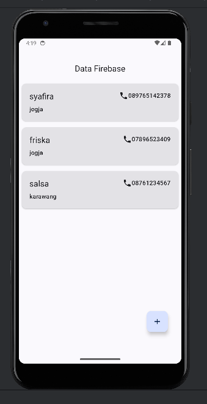  
*Gambar 1: Tampilan awal aplikasi sebelum dilakukan proses edit dan hapus data siswa.*

### 🔹 Kondisi Data Sebelum Edit
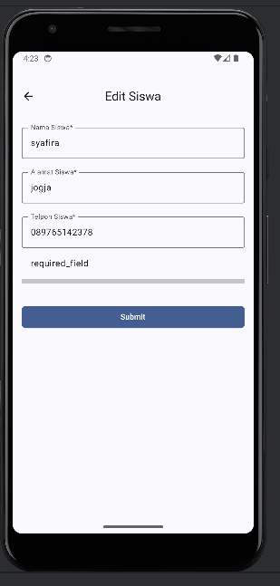  
*Gambar 2: Kondisi data siswa sebelum dilakukan proses edit.*

### 🔹 Halaman Detail Data Siswa
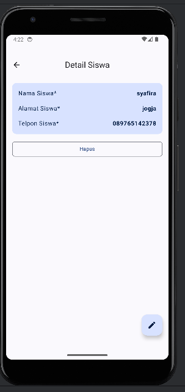  
*Gambar 3: Halaman detail data siswa yang dipilih.*

### 🔹 Halaman Edit Data Siswa
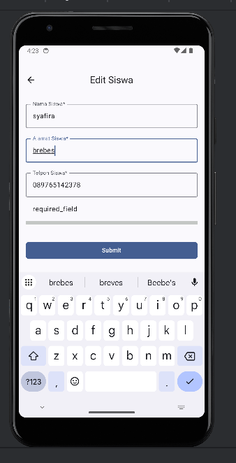  
*Gambar 4: Halaman form untuk mengubah data siswa.*

### 🔹 Tampilan Home Setelah Edit
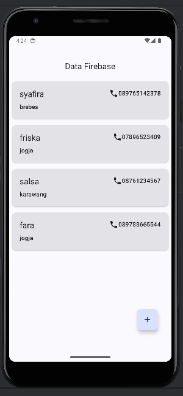  
*Gambar 5: Tampilan aplikasi setelah data siswa berhasil diperbarui.*

### 🔹 Kondisi Database Setelah Edit
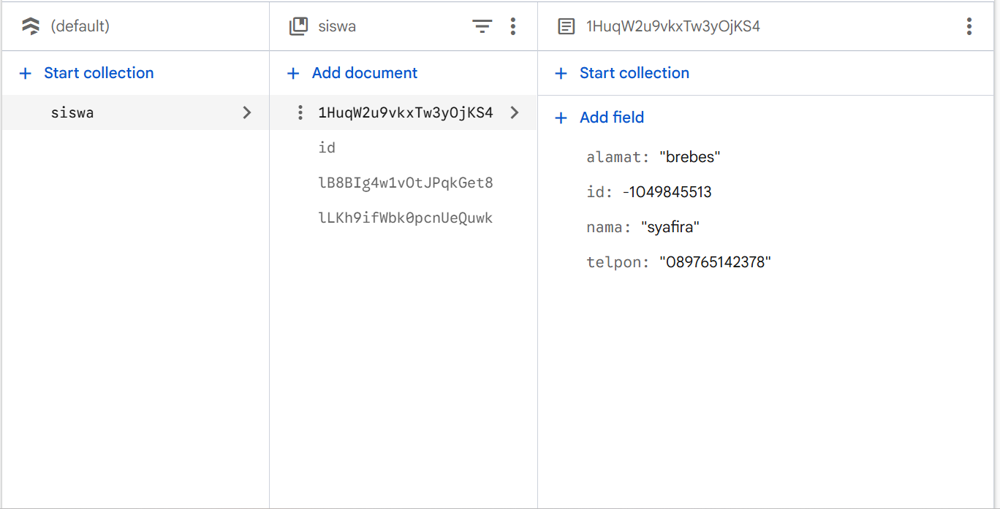  
*Gambar 6: Kondisi database Firebase setelah proses edit data siswa.*

### 🔹 Kondisi Data Sebelum Hapus
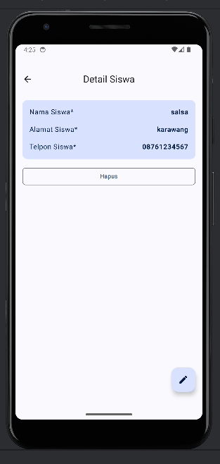  
*Gambar 7: Kondisi data siswa sebelum dilakukan penghapusan.*

### 🔹 Proses Hapus Data Siswa
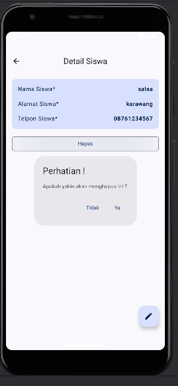  
*Gambar 8: Proses penghapusan data siswa melalui aplikasi.*

### 🔹 Tampilan Setelah Hapus Data
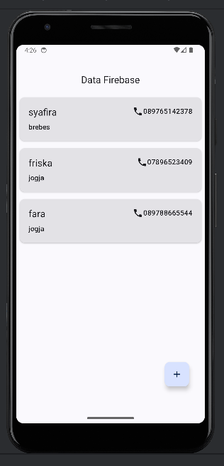  
*Gambar 9: Tampilan aplikasi setelah data siswa berhasil dihapus.*

### 🔹 Kondisi Database Setelah Hapus
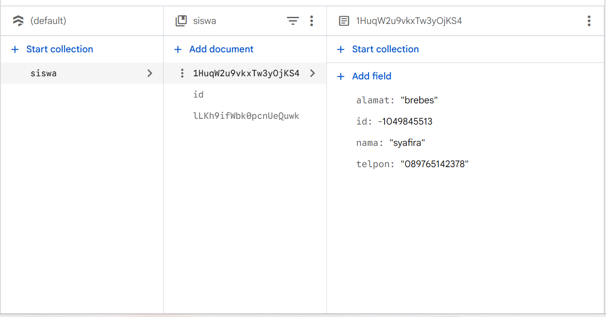  
*Gambar 10: Kondisi database Firebase setelah data siswa dihapus.*

### 🔹 Proses Tambah Data Siswa
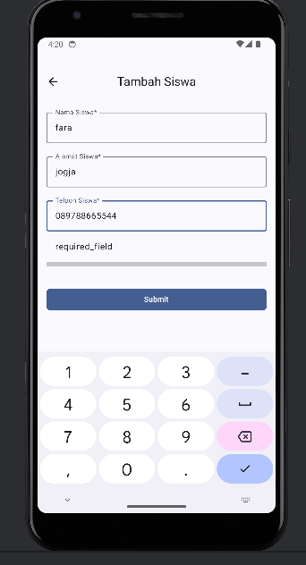  
*Gambar 11: Proses penambahan data siswa.*

### 🔹 Kondisi Database Setelah Tambah Data
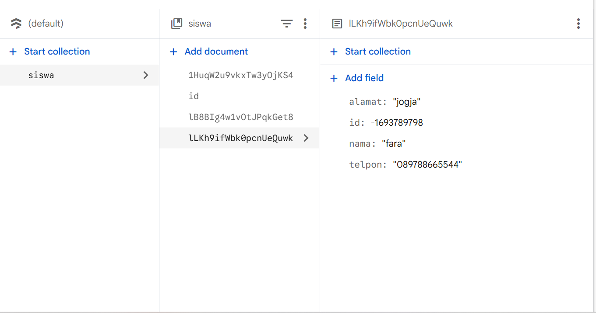  
*Gambar 12: Kondisi database Firebase setelah penambahan data siswa.*
